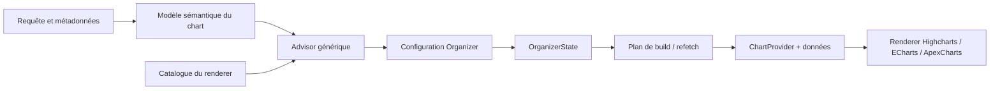

# Roadmap d'architecture — jquery-organizer et charts intelligents

## 1. Vision

`jquery-organizer` doit devenir la couche de pilotage d'un visuel, sans devenir un renderer et sans connaître Highcharts, ECharts ou ApexCharts.

À court terme, il doit proposer les types réellement disponibles dans le renderer utilisé :

- si aucun type n'est surchargé, le menu reprend le catalogue par défaut du renderer ;
- si `chartTypes` est fourni par l'utilisateur, il remplace entièrement le catalogue visible ;
- l'état sélectionné reste générique et est réinjecté par le parent dans le renderer.

À moyen et long terme, le choix ne doit plus seulement dépendre du renderer. Il doit aussi dépendre de la forme du chart construit : dimensions, mesures, unités, cardinalité, nombre de séries, type des données, tables sources et relations entre ces tables.

La cible est donc une chaîne de décision séparée en trois niveaux :



## 2. Constat du code actuel

### 2.1. Contrats déjà utiles

- `jquery-core` est la source de vérité pour `ChartType`, `ChartProvider`, `SerieProvider`, les unités et les transformations de données.
- `jquery-organizer` possède déjà le contrat UI riche : champs X/Y, regroupements, slices, templates, `chartTypes`, `selectedChartType` et `chartTypeSelected`.
- `jquery-highcharts` dispose d'une liste complète de types et d'une map interne `type -> possibleTypes/canPivot`.
- `jquery-echarts` dispose d'un registry de configurateurs par famille de types.
- `jquery-apexcharts` dispose de directives spécialisées et d'une map interne de familles.
- Les renderers acceptent déjà un état Organizer pour la visibilité des séries, mais le bouton Organizer reste actuellement assemblé à côté du renderer par le parent.

### 2.2. Limites actuelles

1. `ChartType` indique qu'un identifiant est autorisé par le contrat, mais ne dit pas quel renderer l'implémente réellement.
2. Les listes de types sont dispersées dans les renderers et ne sont pas exportées comme catalogue public.
3. `possibleTypes` représente surtout les transitions compatibles avec le type courant ; ce n'est pas un catalogue exhaustif.
4. Un `<organizer-button>` frère d'un `<chart>` ne peut pas deviner le renderer actif sans couplage implicite ou configuration du parent.
5. `jquery-core` et `jquery-organizer` possèdent aujourd'hui deux niveaux de contrats Organizer historiques. Cette frontière doit être clarifiée avant d'ajouter beaucoup de métadonnées.
6. Les modèles actuels décrivent surtout une vue déjà construite ; ils ne décrivent pas encore les tables, champs, unités et agrégations d'une requête à venir.

## 3. Décisions d'architecture

### 3.1. Ownership des responsabilités

| Couche | Responsabilité | Ne doit pas faire |
|---|---|---|
| `jquery-core` | Contrats génériques, métadonnées, capacités, planification pure | Importer un renderer concret |
| `jquery-highcharts` | Déclarer et rendre ses types Highcharts | Décider de la requête métier |
| `jquery-echarts` | Déclarer et rendre ses types ECharts | Connaître Organizer visuellement |
| `jquery-apexcharts` | Déclarer et rendre ses types ApexCharts | Dupliquer les règles métier de recommandation |
| `jquery-organizer` | Afficher les choix, maintenir l'état, appliquer les overrides | Connaître la liste Highcharts/ECharts/ApexCharts |
| Application ou future facade de chart | Relier catalogue, Organizer, requête et renderer | Mettre des règles de compatibilité dans le template |

La liste par défaut doit donc vivre dans chaque renderer, mais son format doit être défini dans `jquery-core`. `jquery-organizer` reçoit un catalogue générique et ne connaît que sa forme.

### 3.2. Catalogue générique de types

Ajouter dans `jquery-core` un contrat de données, par exemple `chart-type-catalog.model.ts` :

```typescript
export type ChartRendererId = 'highcharts' | 'echarts' | 'apexcharts' | string;

export type ChartTypeFamily =
  | 'cartesian'
  | 'single'
  | 'polar'
  | 'range'
  | 'scatter'
  | 'hierarchy'
  | 'matrix'
  | 'map'
  | 'mixed';

export interface ChartTypeCapabilities {
  family: ChartTypeFamily;
  canPivot?: boolean;
  supportsMultipleSeries?: boolean;
  supportsMultipleAxes?: boolean;
  requiresContinuousX?: boolean;
  requiresCategoryX?: boolean;
  requiresRangeY?: boolean;
  requiresSizeDimension?: boolean;
  requiresHierarchy?: boolean;
  requiresGeoData?: boolean;
  maxYAxes?: number;
}

export interface ChartTypeDescriptor {
  id: ChartType;
  label: string;
  icon?: string;
  capabilities: ChartTypeCapabilities;
  aliases?: readonly string[];
}

export interface ChartTypeCatalog {
  renderer: ChartRendererId;
  version?: string;
  types: readonly ChartTypeDescriptor[];
}
```

Le descripteur reste sérialisable et ne contient pas de fonction de renderer. Les règles de construction restent dans le renderer ; les capacités décrivent uniquement ce qu'un advisor générique peut exploiter.

### 3.3. Catalogue propre à chaque renderer

Chaque package exporte une constante immuable, par exemple :

```typescript
export const HIGHCHARTS_CHART_TYPE_CATALOG: ChartTypeCatalog = {
  renderer: 'highcharts',
  types: [/* tous les types réellement implémentés */],
};
```

Les catalogues doivent être dérivés du point de vérité existant, et non recopier une deuxième liste :

- Highcharts : partir des familles `STANDARD_CHARTS`, `SIMPLE_CHARTS`, `POLAR_CHARTS`, `RANGE_CHARTS`, `BUBBLE_CHARTS`, `HEATMAP_CHARTS`, `TREEMAP_CHARTS`, `MAP_CHARTS` ; dériver également la logique de transition.
- ECharts : enrichir `EChartTypeConfigurator` avec ses types et métadonnées ; dériver le catalogue du registry.
- ApexCharts : déclarer les types supportés dans les définitions de directives/familles ; dériver le catalogue de cette source.

Le catalogue doit contenir tous les types implémentés, y compris les types conditionnels comme `map`, `range`, `bubble` ou `treemap`. La compatibilité avec les données courantes sera traitée par l'advisor. Cela évite de confondre « implémenté par le renderer » et « pertinent pour ce chart précis ».

### 3.4. Règles de surcharge dans Organizer

Faire évoluer `OrganizerConfig` avec une source de defaults générique :

```typescript
export interface OrganizerConfig {
  chartTypeCatalog?: ChartTypeCatalog;
  chartTypes?: OrganizerChartType[];
  // ...
}
```

Résolution recommandée :

1. `chartTypes === undefined` et `chartTypeCatalog` fourni : afficher tous les types du catalogue, dans l'ordre du catalogue.
2. `chartTypes !== undefined` : afficher uniquement cette liste, dans l'ordre fourni par l'utilisateur. Cela inclut `[]`, qui signifie explicitement « ne rien afficher ».
3. `chartTypes === undefined` et aucun catalogue : ne pas inventer de types ; conserver le comportement legacy et masquer le sous-menu.
4. Pour un override partiel, compléter le `label` et l'icône depuis le catalogue quand l'identifiant existe.
5. Un type sélectionné qui n'existe plus dans la liste résolue est normalisé vers le premier type actif, ou vers `undefined` si aucun type n'est disponible.

Il est important de conserver la distinction entre :

- `chartTypeCatalog` : capacités et types fournis par le host/renderer ;
- `chartTypes` : choix explicite de l'utilisateur ;
- `selectedChartType` : état courant ;
- `possibleTypes` : transitions internes ou compatibilité bas niveau du renderer.

Un bouton Organizer isolé ne peut pas déduire de manière fiable le package graphique frère. Le branchement explicite d'un catalogue est donc le minimum nécessaire pour rester découplé. Une future facade de composition pourra automatiser ce branchement sans modifier le composant Organizer.

## 4. Plan d'implémentation par phases

### Phase 0 — Stabiliser les contrats et les noms

**Objectif :** éviter de construire le moteur futur sur deux contrats Organizer concurrents.

Actions :

- confirmer que le contrat UI enrichi de `jquery-organizer` est le contrat utilisé par le bouton ;
- décider si `jquery-core.OrganizerConfig` reste le contrat bas niveau de visibilité des séries ou s'il doit être renommé pour éviter l'ambiguïté ;
- documenter les alias éventuels (`view` ApexCharts versus `organizer` Highcharts/ECharts) sans casser l'API existante ;
- figer la sémantique `undefined`, override vide et type sélectionné absent.

**Livrable :** tableau de compatibilité des API publiques et note de migration.

### Phase 1 — Catalogue exhaustif par renderer

**Objectif :** réaliser le besoin immédiat sans introduire de logique de requête.

Actions :

1. Ajouter `ChartTypeDescriptor` et `ChartTypeCatalog` dans `jquery-core`, puis les exporter.
2. Créer le catalogue Highcharts à partir des constantes existantes.
3. Ajouter les métadonnées de types au registry ECharts et exposer son catalogue.
4. Extraire le catalogue ApexCharts depuis ses directives/familles.
5. Déduire les maps `possibleTypes`/`_charts` des mêmes définitions quand c'est possible.
6. Exporter les trois catalogues dans les `public-api.ts` des packages.
7. Ajouter les tests de cohérence : identifiant unique, type catalogué réellement routable, famille correcte, `canPivot` cohérent.

**Résultat attendu :** aucun parent ne saisit plus manuellement la liste complète des types d'un renderer.

### Phase 2 — Résolution des types dans `jquery-organizer`

**Objectif :** rendre la règle default/override fiable et testable.

Actions :

- ajouter `chartTypeCatalog` au contrat Organizer ;
- créer une fonction pure `resolveOrganizerChartTypes(catalog, override, context?)` ;
- centraliser la normalisation de `selectedChartType` dans cette fonction ;
- faire utiliser la liste résolue par `hasChartTypes`, le libellé actif et le menu ;
- préserver l'ordre et les labels personnalisés d'un override ;
- ignorer ou désactiver les identifiants inconnus selon une politique documentée, avec avertissement en mode debug ;
- décider explicitement si `reset` revient au type initial ou conserve le type courant. Recommandation : réinitialiser tout l'état Organizer, y compris le type, quand le reset est activé.

**Tests ciblés :** default complet, override partiel, override vide, catalogue absent, sélection invalide, changement de catalogue en cours de vie.

### Phase 3 — Branchement des trois wrappers

**Objectif :** obtenir le même mode d'intégration avec Highcharts, ECharts et ApexCharts.

Actions :

- documenter l'import du catalogue de chaque wrapper dans les exemples ;
- fournir une fonction utilitaire pure de type `withChartTypeCatalog(config, catalog)` si cela réduit le boilerplate ;
- conserver les inputs historiques (`possibleTypes`, `view`) pendant la migration ;
- ajouter un mode de compatibilité qui utilise le catalogue pour les defaults, sans changer le pipeline de rendu ;
- synchroniser le `selectedChartType` Organizer avec le `type` du renderer dans les trois exemples ;
- aligner les noms `organizer` / `organizerState` à terme, en gardant un alias ApexCharts tant qu'une migration breaking change n'est pas décidée.

**Critère de sortie :** le même exemple parent peut choisir le catalogue du renderer courant, surcharger deux types, puis changer effectivement le renderer.

### Phase 4 — Capacités et compatibilité avec les données

**Objectif :** distinguer « disponible dans la lib » de « valide pour le chart actuel ».

Introduire dans `jquery-core` des exigences simples, sans encore gérer les requêtes :

```typescript
export interface ChartDataShape {
  dimensionCount: number;
  measureCount: number;
  seriesCount: number;
  hasTimeDimension?: boolean;
  hasCategoryDimension?: boolean;
  hasRangeValues?: boolean;
  hasHierarchy?: boolean;
  hasGeoDimension?: boolean;
  distinctUnitCount?: number;
}

export interface ChartTypeAvailability {
  type: ChartTypeDescriptor;
  status: 'available' | 'disabled' | 'recommended';
  reasons: string[];
}
```

Règles initiales :

- les mêmes unités peuvent partager un axe Y, quel que soit le nombre de séries ;
- des unités incompatibles doivent être réparties sur des axes distincts ou provoquer une recommandation de séparation ;
- la politique par défaut limite à deux axes Y ;
- `range`, `bubble`, `heatmap`, `treemap`, `map` et `mixed` exigent une forme de données particulière ;
- les types non compatibles restent visibles mais désactivés avec une raison lisible, plutôt que de disparaître silencieusement.

Cette phase permet de conserver la promesse « tous les types de la lib sont visibles » tout en évitant de proposer une transition impossible pour les données courantes.

### Phase 5 — Métadonnées sémantiques de chart et de requête

**Objectif :** préparer les charts construits depuis une requête sans faire de `jquery-organizer` un client SQL.

Ajouter dans `jquery-core` un modèle indépendant des APIs de base de données :

```typescript
export type ChartDataType =
  | 'string'
  | 'category'
  | 'number'
  | 'integer'
  | 'boolean'
  | 'date'
  | 'datetime'
  | 'duration'
  | 'size'
  | 'percentage'
  | 'currency'
  | 'geo';

export interface ChartFieldMetadata {
  id: string;
  sourceId: string;
  fieldId: string;
  label: string;
  dataType: ChartDataType;
  unit?: string | UnitConfig;
  unitGroup?: string;
  nullable?: boolean;
  cardinality?: number;
  allowedAggregates?: string[];
  defaultAggregate?: string;
}

export interface ChartSourceMetadata {
  id: string;
  tableId: string;
  label?: string;
  fields: ChartFieldMetadata[];
}

export interface ChartQueryMetadata {
  sources: ChartSourceMetadata[];
  joins?: unknown[];
  estimatedRowCount?: number;
}
```

Principes :

- utiliser un identifiant stable `sourceId.fieldId` ou équivalent pour éviter les collisions entre tables ;
- séparer `dataType` et `unit` : une durée, une taille et un pourcentage sont numériques mais ne se recommandent pas pareil ;
- conserver les fonctions de formatage dans les runtime providers, car elles ne sont pas sérialisables ;
- ne pas mettre de SQL, de requête HTTP ou d'Observable dans les modèles de métadonnées ;
- enrichir progressivement `OrganizerChartItem` avec une référence de source et les métadonnées utiles, au lieu de remplacer immédiatement le contrat UI.

### Phase 6 — Advisor de types, agrégations et axes

**Objectif :** produire des choix pertinents, explicables et testables.

Créer un service/fonction pure dans `jquery-core`, alimenté par :

- `ChartQueryMetadata` ;
- le modèle sémantique du chart ;
- le `ChartTypeCatalog` du renderer ;
- une politique configurable (`maxYAxes`, types autorisés, préférence utilisateur).

Sorties recommandées :

```typescript
export interface ChartTypeRecommendation {
  type: ChartType;
  score: number;
  status: 'recommended' | 'available' | 'disabled';
  reasonCodes: string[];
}

export interface ChartAxisPlan {
  axisIndex: number;
  unitGroup?: string;
  seriesIds: string[];
}

export interface ChartBuildPlan {
  chartType: ChartType;
  aggregateByField: Record<string, string>;
  axes: ChartAxisPlan[];
  warnings: string[];
}
```

Premières règles métier :

- axe temporel + une ou plusieurs mesures : `line`, `area`, éventuellement `spline` ;
- catégories limitées + mesures : `column` ou `bar` ;
- composition d'un total : `pie` ou `donut`, seulement si le nombre de catégories reste lisible ;
- deux valeurs min/max : types `range` ;
- deux dimensions numériques et une taille : `scatter` ou `bubble` ;
- hiérarchie : `treemap` ;
- matrice dimensionnelle : `heatmap` ;
- géographie : `map` si le renderer et les données le permettent ;
- plusieurs mesures de même unité : plusieurs séries sur le même axe ;
- unités incompatibles : au maximum deux axes, sinon séparer, agréger par famille compatible ou demander un choix explicite ;
- agrégat par défaut selon le type : `sum` pour une quantité additive, `avg` pour une mesure moyenne, `count` pour un volume, percentile pour certaines durées, sans jamais deviner silencieusement une règle métier non fournie.

Chaque recommandation doit pouvoir retourner des `reasonCodes` afin que l'UI explique une décision et que les tests vérifient une règle sans dépendre d'un texte traduit.

### Phase 7 — Orchestration query -> chart

**Objectif :** permettre à Organizer de piloter un chart issu d'une requête sans mélanger les responsabilités.

Créer progressivement une facade de session, idéalement hors du composant visuel :

```text
Query adapter
  -> ChartQueryMetadata
  -> ChartSemanticModel
  -> ChartBuildPlan
  -> fetch/build data
  -> ChartProvider + rows
  -> renderer
```

Le composant Organizer doit seulement :

- afficher les choix résolus ;
- émettre l'intention utilisateur ;
- conserver l'état ;
- signaler qu'un refetch/rebuild est nécessaire.

La facade de session doit :

- savoir si plusieurs tables sont ciblées ;
- convertir les champs sélectionnés en dimensions/mesures ;
- recalculer les agrégats et le plan d'axes ;
- invalider le cache quand la requête, les filtres ou le type changent ;
- protéger les réponses asynchrones périmées ;
- transmettre au renderer un `ChartProvider` stable et les données construites.

Événements futurs possibles, à ajouter seulement quand le build les supporte réellement :

- `dimensionsChanged` ;
- `measuresChanged` ;
- `aggregateChanged` ;
- `axisPlanChanged` ;
- `queryChanged` ;
- `chartPlanChanged`.

### Phase 8 — Persistance, accessibilité et observabilité

**Objectif :** rendre les décisions reproductibles et maintenables.

- versionner les snapshots de `OrganizerState` et de `ChartBuildPlan` ;
- ne persister que des identifiants et valeurs sérialisables, jamais des `DataProvider` ou formatters ;
- restaurer un état ancien avec une normalisation tolérante ;
- afficher les raisons des types désactivés et les avertissements d'axes ;
- ajouter des tests de contrat communs exécutés pour les trois catalogues ;
- ajouter des tests d'intégration de refetch avec réponses dans le désordre ;
- instrumenter les refus de plan : type indisponible, trop d'unités, agrégat absent, données incompatibles.

## 5. API cible d'utilisation

### Cas par défaut

Le parent ne recopie aucun type :

```typescript
import { HIGHCHARTS_CHART_TYPE_CATALOG } from '@oneteme/jquery-highcharts';

organizerConfig: OrganizerConfig = {
  chartTypeCatalog: HIGHCHARTS_CHART_TYPE_CATALOG,
};
```

Le menu affiche tous les types déclarés par Highcharts. Le parent conserve la synchronisation de l'état :

```typescript
onOrganizerChange(event: OrganizerButtonEvent): void {
  this.organizerState = event.state;
  if (event.state.selectedChartType) {
    this.chartType = event.state.selectedChartType as ChartType;
  }
}
```

### Cas avec surcharge

```typescript
organizerConfig: OrganizerConfig = {
  chartTypeCatalog: HIGHCHARTS_CHART_TYPE_CATALOG,
  chartTypes: [
    { id: 'line', label: 'Courbe' },
    { id: 'column', label: 'Colonnes' },
  ],
};
```

Seuls `line` et `column` sont affichés. Le catalogue reste disponible pour compléter les métadonnées et valider les identifiants, mais il ne réintroduit pas les autres types dans le menu.

## 6. Stratégie de tests

### Tests unitaires

- catalogue de chaque renderer non vide et sans doublon ;
- résolution sans override ;
- résolution avec override ;
- override vide ;
- catalogue absent ;
- sélection initiale et sélection devenue invalide ;
- compatibilité `canPivot` ;
- recommandation pour temps, catégories, ranges, hiérarchie, géographie ;
- regroupement de séries par unité ;
- blocage à plus de deux axes Y ;
- agrégats autorisés et agrégat par défaut.

### Tests d'intégration

- Organizer -> parent -> Highcharts ;
- Organizer -> parent -> ECharts ;
- Organizer -> parent -> ApexCharts ;
- changement de type sans perte de visibilité des séries ;
- changement de requête avec réponse asynchrone périmée ;
- restauration d'un état contenant un type supprimé du catalogue.

### Validation navigateur

Pour chaque renderer :

1. ouverture du menu ;
2. vérification de la liste exhaustive par défaut ;
3. clic sur un type simple ;
4. surcharge avec deux types et vérification que les autres disparaissent ;
5. vérification visuelle du rendu et du libellé actif ;
6. vérification d'un type conditionnel avec données incompatibles après la phase 4.

## 7. Ordre recommandé de réalisation

1. Phase 0 : clarifier les deux contrats Organizer et les règles `undefined`/override.
2. Phases 1 et 2 : catalogue générique + résolution Organizer. C'est le prochain incrément livrable.
3. Phase 3 : aligner les trois wrappers et les pages de documentation.
4. Phase 4 : capacités et disponibilité contextuelle, sans requête distante.
5. Phases 5 et 6 : métadonnées, advisor, agrégations et axes.
6. Phase 7 : facade de session et construction depuis une requête.
7. Phase 8 : persistance, tests de non-régression et observabilité.

## 8. Garde-fous

- Ne pas importer `jquery-highcharts`, `jquery-echarts` ou `jquery-apexcharts` dans `jquery-organizer`.
- Ne pas placer les listes de types des renderers dans `jquery-organizer`.
- Ne pas transformer `possibleTypes` en catalogue public par défaut : il décrit une compatibilité de transition, pas l'implémentation totale.
- Ne pas mettre le fetch de données dans `OrganizerButtonComponent`.
- Ne pas calculer les axes uniquement à partir du nombre de séries : l'unité et la compatibilité des unités sont déterminantes.
- Ne pas cacher définitivement les types conditionnels : les cataloguer, puis les désactiver ou les recommander selon le contexte.
- Ne pas faire évoluer `ChartProvider` en modèle de requête complet : garder le provider comme contrat de rendu et introduire un modèle sémantique séparé.
- Ne pas faire dépendre les règles de recommandation d'un texte d'interface ou d'un ordre de tableau accidentel.

## 9. Questions à trancher avant la phase 2

1. `chartTypes: []` doit-il masquer le sous-menu ou afficher un état vide ? Recommandation : masquer, car c'est un override explicite.
2. Le reset doit-il restaurer le premier type du catalogue ou le type initial fourni par le parent ? Recommandation : le type initial du parent, puis le premier type actif en fallback.
3. Les types inconnus dans un override doivent-ils être affichés pour les renderers externes ? Recommandation : les conserver dans Organizer, mais les marquer invalides si un catalogue est disponible.
4. Le catalogue doit-il être fourni explicitement par le parent dans un premier temps ? Recommandation : oui ; une facade de composition pourra automatiser ensuite, sans couplage entre composants frères.
5. Le plan doit-il autoriser deux unités convertibles sur un même axe ? Recommandation : oui, uniquement si une relation de conversion explicite existe ; sinon deux groupes d'unités distincts.

## 10. Résultat attendu

La première livraison ne doit ajouter qu'un contrat de catalogue, trois exports de catalogues et la résolution default/override dans Organizer. Elle doit être indépendante de toute requête.

Les phases suivantes pourront alors enrichir l'intelligence sans réécrire le menu, les wrappers ou le contrat de rendu : Organizer exprimera l'intention, `jquery-core` calculera les possibilités génériques, chaque renderer déclarera ses capacités, et une facade de session pilotera le fetch et le rebuild du chart.
